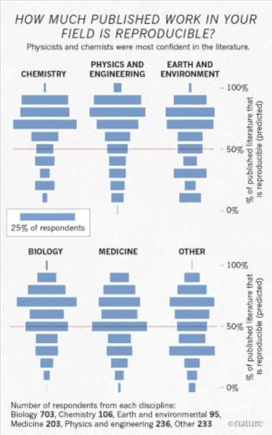
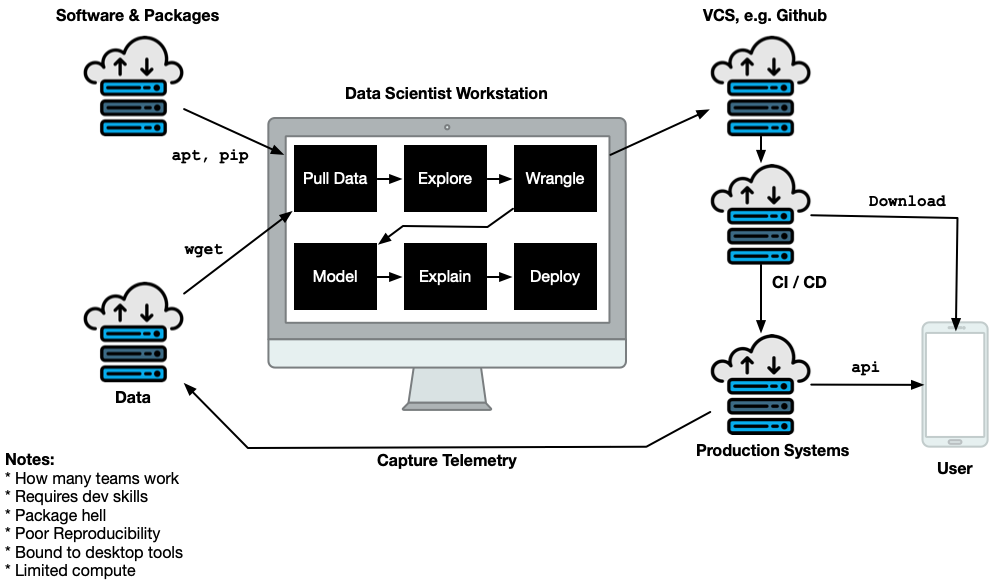
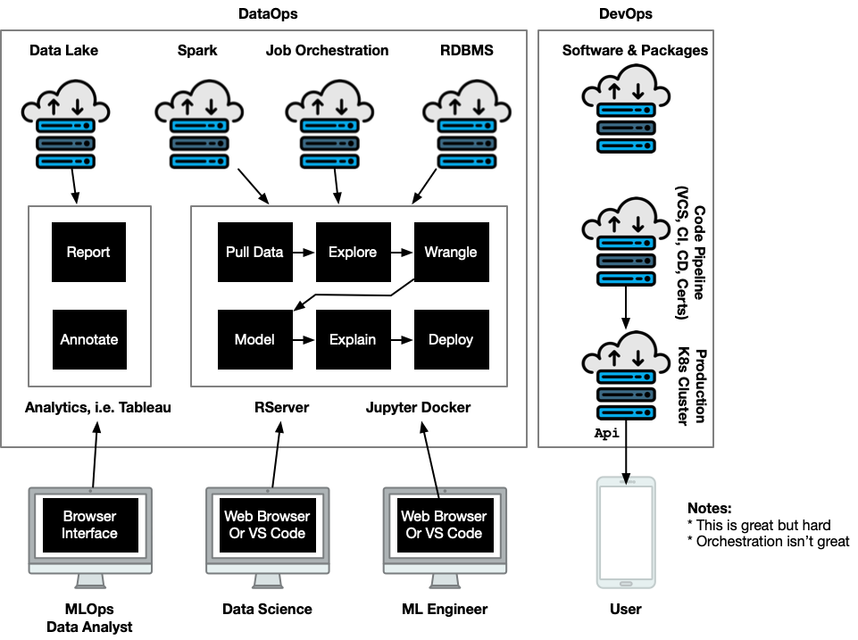

# Appendix

## How Usability and Reproducibility in Software Improves Teaching and Research

### Soren Harner, RC2AI

---

# Reproducibility

Given the same raw data, can you follow the steps and understand the assumptions of how the authors arrived at their conclusion?

---

# Why does it matter?

* Improves trust and transparency in science and beyond
* Promotes learning, habits, and building on others' work

---

# In Research

* [Nature 2016 Survey](https://www.nature.com/articles/533452a) 52% say there is crisis 
* [Nature 2021 Survey](https://www.nature.com/articles/s41562-021-01115-7) confidence in science leads to vaccination

---

# In Education

Jim's pioneering work designing data science programs supporting:

* Greater role of data in all fields
* Rise of computational sciences

---

# Why is it hard?

* Accessible data, code, and runtime
* Replicate the environment
* Not WYSIWYG
* Cloud operations
* Trust chain for security
  
---

# Jim and team built

* [$RC^2$](https://github.com/mlilback/rc2SwiftClient) iOS and Mac Swift Client for Notebooks with remote computation
* [RSpark](https://github.com/jharner) a "Big Data" Docker-base compute environment with R, Spark, and other packages

---

# Late nights discussing

* Python, Spark, R, etc.
* Authoring in R Markdown vs. Jupyter
* Apache Arrow for data
* Docker, Kubernetes, and GPUs
* (Use Icons)

---

# NoteCalc

* Reproducibility made easy
* Author computational notebooks
* Read, share, re-use
* Cloud service or run yourself

---
# Remote Computation

---

# Notebook Authoring

* VS Code Extension
* Unique in Github or Bitbucket URL per notebook
* Leveraging language servers, etc.
* Add style and interactivity with CSS, Javascript
* Declare runtimes and dependencies

---

# Notebook Readers

* Mobile and Web apps for rendered interactive markdown documents
* Run and experiment with code chunks
* Clone, modify, comment, share

---

# Remote Code Chunks

* Local markdown parser and language servers
* Run R, Python, etc., code chunks on remote sessions
* Local graphics interactivity with Javascript, CSS

---

# Cloud Services

* User management and collaboration services
* Tamper-proof versioned datasets in Apache Parquet
* R, Python, etc., runtimes based on Docker images
* Kubernetes cluster

---

# Next Steps

* Launch as an on-line platform
* Looking for open source collaborator to build it
* Looking for pilot it for teaching data related courses
* We have some funding

---

# Appendix

---

# Remove friction

1. Sign up
1. Install the App
1. Invite collaborators, which can be students
1. Author, find, critique, reuse
1. Share

---

# What's broken with notebooks

* Block structure, but REPL underneath

---

# Execution Graph

* Notebook defines a computation graph

Python Block -> R Block -> R Block

Env in Arrow

---

## Reproduciblity Requires

* Code and data are available
* Toolchain is open source
* Documentation is in plain text
* Data is immutable, inspectable, and described
* Code is versioned and literate
* Dependencies are declared and packaged

---

# More broadly, sharing

* [Wikipedia](https://www.wikipedia.org/)
* [Arxiv](https://arxiv.org/)
* [Papers with Code](https://paperswithcode.com/)
* [GitHub](https://github.com/)
* [DockerHub](https://github.com/)
* [Stack Overflow](https://stackoverflow.com/)

---

# Anti examples, more broadly

* Results cannot be replicated
* WYSIWYG documents (Word, Excel) on shared drives
* Sharing by copy, paste
* "It worked on my machine"
* Blackbox models and algorithms
* Automated disinformation
* Spoofing identity and fraud

---

## Authoring Data Science Reproducibly

* Documents built from versioned natural language, code, data, and infrastructure
* Readers can run it, interact with it, and build on it
* Machines can read and exchange it
* Leverage "the Cloud" for scalability
* Identity and assets are verifiable
* Meta authoring
  
---

## Meta Authoring Supports Usability

* Types and Schemas and "data about data"
* "IntelliSense" and language servers (e.g. VS Code Ecosystem)
* Linked data and entity linking
* Semantic discovery and recommentations (e.g. BERT and GPT2)

---

##

---

---

# Literate Programming

* Markdown, e.g. Knitr
* $\LaTeX$ and $\KaTeX$
* Funcitonal Programming
* Grammar of Graphics
* GraphViz
* Dataframes and Pipelines

---

# Language Servers

---

# Cloud Workloads

* Dockerfiles declare dependencies
* Container as a computational unit
* Kubernetes workloads
* GPUs for vertical scale
* Data in Cloud Storage
* CI/CD Pipelines from Git

---

<!-- _backgroundColor: aqua -->

# Introducing RC2AI

* Designed for Teaching
* Executable Markdown Documents
* VS Code Extension
* NoteCalc mobile app
* Supported by Cloud Services

---

# Interactive Data Analysis

* Brushing and Linked Data
* Interactive Controls
* Streamlit and Shiny

---

# Sharing and Collaboration

* Built on reproducibility
* Mobile devices
* Export snips
* Share links
* Comment and critique

---

# Markdown Notebook Editing

* Monoco Editor with CSS, Javascript
* R, Python language servers
* iOS, Android clients for phone and tablet
* MS Visual Code Extension for Linux, Mac, Windows Desktop

---

# Interactivity

* Brushing and linking in VegaLite
* Javascript in CSS

---

# Cloud Services

* Remote R, Python, Julia in cloud containers
* Big Data through Spark and Apache Arrow Ballista
* Run GPU containers for RAPIDS, PyTorch, Tensorflow
* Identity Management

---

# Reproducibility and Sharing

* Share notebooks and their cloud runtimes through App
* Github, Bitbucket integration
* Apache Arrow Datasets on Cloud Storage
* Publish documents, e.g. Dropbox

---

# Data Science Workflow

---

# Smart Notebooks

---

# Desktop Centric Workflow

---

# Server Centric Workflow

---

# Reading and Sharing

* Notebook has a unique endpoint
* Monoco Editor (from VS Code)
* Native Application
* Manage a set of Notebooks
* Interactive controls for parameters
* Edit mode
* Share with collaborators

---

# Soren Harner Bio Long

Soren is a data scientist working in computer vision, natural language, probablistic programming, and big data. He took over RC2AI after his father Jim Harner passed away and seeks collaborators in data science education. In his 25 year career, Soren held executive product leadership roles in companies such as Atlassian, BigCommerce, and MuleSoft. He is also CTO at LayerJot, a computer vision company in Healthcare. Soren has a MSCS with an AI specialization from Stanford University.
--- 

# Brian's Presentation and Book

[“Achieving Practical Reproducibility with Transparency and Accessibility” (DSSV 2020)](https://cartesianfaith.files.wordpress.com/2020/07/rowe-dssv-2020.pdf)

[Introduction to Reproducible
Science in R](https://cartesianfaith.files.wordpress.com/2018/11/rowe-introduction-to-reproducible-science-part-i-20181113.pdf)

---

# Bio

Soren Harner is a data scientist working in computer vision, natural language, and big data. He has taken over RC2AI from his father Jim Harner, 

---

# Articles

[1,500 scientists lift the lid on reproducibility](https://www.nature.com/articles/533452a)

[What does research reproducibility mean?](https://stm.sciencemag.org/content/8/341/341ps12)

[Trust in science, social consensus and vaccine confidence](https://www.nature.com/articles/s41562-021-01115-7), Nature 2021 Survey

