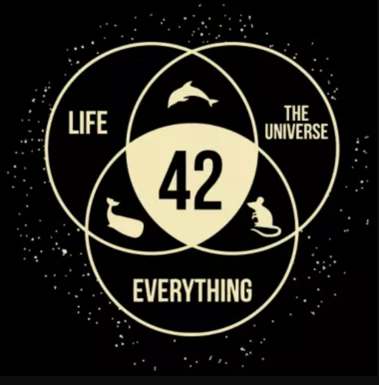
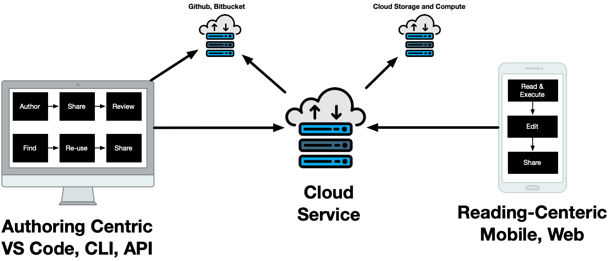

# Appendix

### How Usability and Reproducibility in Software Improves Teaching and Research

### Soren Harner, RC2AI

---

### Jim's 50 years in statistical computing

---

### 1990s Interactive Graphics in XLispStat

---

### 2000s JavaStat: GUI with R Backend

---

### After 2015: RSpark and Reproducibility

* Teach data science courses and seminars
* Introduce SQL, DataFrames, MapReduce, Streaming
* Emphasis on reproducibility with Docker and Git
* Built on R, Spark, Apache Arrow, and Postgres
* Building on [rocker](https://www.rocker-project.org), R on Docker
* Brought back XLispStat with [xStartR](http://www.user2019.fr/static/pres/t246174.pdf)

---

### $Rc^2$ Reprocibility for Everyone

  
---

<!-- _backgroundColor: black -->

---

# Reproducibility

Given the same raw data, can you follow the steps and understand the assumptions of how the authors arrived at their conclusion?

---

### Why does it matter?

* Learning and building on others' work
* Transparency over authority

---

### Reproducibility in Research

* [Nature 2016 Survey](https://www.nature.com/articles/533452a) 52% say there is crisis 
* [Nature 2021 Survey](https://www.nature.com/articles/s41562-021-01115-7) confidence in science leads to vaccination

---

### Teach reproducibility

* Data used in all fields
* Computational sciences
* Larger models and big data

---

## Why is it hard?

* Methods and habits
* Accessible tools and data
* Versioning everything
* Sharing and identity

---

<!-- 
_backgroundColor: black
color: white
-->

# Continuing Jim's Work

---

### Author reproducibly

<!-- 
color: back
-->

* Versioned markdown
* Executable code chunks
* VS Code, Github ecosystem
* R, Python, Julia, etc.
* Javascript, CSS, vegalite
* Pull request to publish

---

### Read, tinker

* Read, share, re-use interactive notebooks
* Mobile and Web
* Obviate the calculator
* Better than static books and reports
* Verifiable, tamperproof

---

### Accessible, scalable cloud containers

---

### Collaboration services

---

### Instructor student sharing

---

# You can get involved

* Use it to share your courses
* Looking for open source collaborators
* Some funding available

---

# Thank you

### [Link to presentation, references, etc.](https://github.com/sharner/notecalc/blob/main/documents/sdss_preso/)

---

### Reproducibility key to sharing

* Accessible code, e.g. Github
* Accessible, tamper-proof dataset vault, e.g. Arrow
* Accessible environment, e.g. Dockerfiles
* Notebook compiled into computational graph, i.e. shared random seed, externalized jobs
* Verifiable identity, auditable

---

### Instructor, student collaboration

---

# Notebook Authoring

* VS Code Extension
* Unique in Github or Bitbucket URL per notebook
* Leveraging language servers, etc.
* Add style and interactivity with CSS, Javascript
* Declare runtimes and dependencies

---

# Notebook Readers

* Mobile and Web apps for rendered interactive markdown documents
* Run and experiment with code chunks
* Clone, modify, comment, share

---

# Remote Code Chunks

* Local markdown parser and language servers
* Run R, Python, etc., code chunks on remote sessions
* Local graphics interactivity with Javascript, CSS

---

# Cloud Services

* User management and collaboration services
* Tamper-proof versioned datasets in Apache Parquet
* R, Python, etc., runtimes based on Docker images
* Kubernetes cluster

---

# Next Steps

* Launch as an on-line platform
* Looking for open source collaborator to build it
* Looking for pilot it for teaching data related courses
* We have some funding

---

# In Education

Jim's pioneering work designing data science programs supporting:

* Greater role of data in all fields
* Rise of computational sciences

---

# Jim and team built

* [$RC^2$](https://github.com/mlilback/rc2SwiftClient) iOS and Mac Swift Client for Notebooks with remote computation
* [RSpark](https://github.com/jharner) a "Big Data" Docker-base compute environment with R, Spark, and other packages

---

# Remove friction

1. Sign up
1. Install the App
1. Invite collaborators, which can be students
1. Author, find, critique, reuse
1. Share

---

# What's broken with notebooks

* Block structure, but REPL underneath

---

# Execution Graph

* Notebook defines a computation graph

Python Block -> R Block -> R Block

Env in Arrow

---

## Reproduciblity Requires

* Code and data are available
* Toolchain is open source
* Documentation is in plain text
* Data is immutable, inspectable, and described
* Code is versioned and literate
* Dependencies are declared and packaged

---

# More broadly, sharing

* [Wikipedia](https://www.wikipedia.org/)
* [Arxiv](https://arxiv.org/)
* [Papers with Code](https://paperswithcode.com/)
* [GitHub](https://github.com/)
* [DockerHub](https://github.com/)
* [Stack Overflow](https://stackoverflow.com/)

---

# Anti examples, more broadly

* Results cannot be replicated
* WYSIWYG documents (Word, Excel) on shared drives
* Sharing by copy, paste
* "It worked on my machine"
* Blackbox models and algorithms
* Automated disinformation
* Spoofing identity and fraud

---

## Authoring Data Science Reproducibly

* Documents built from versioned natural language, code, data, and infrastructure
* Readers can run it, interact with it, and build on it
* Machines can read and exchange it
* Leverage "the Cloud" for scalability
* Identity and assets are verifiable
* Meta authoring
  
---

## Meta Authoring Supports Usability

* Types and Schemas and "data about data"
* "IntelliSense" and language servers (e.g. VS Code Ecosystem)
* Linked data and entity linking
* Semantic discovery and recommentations (e.g. BERT and GPT2)

---

# Literate Programming

* Markdown, e.g. Knitr
* $\LaTeX$ and $\KaTeX$
* Funcitonal Programming
* Grammar of Graphics
* GraphViz
* Dataframes and Pipelines

---

# Language Servers

* Support different IDEs and environments
* Code completion for language and symbols
* Hover, Jump to Ref, Find References
* Diagnostics

---

# Cloud Workloads

* Dockerfiles declare dependencies
* Container as a computational unit
* Kubernetes workloads
* GPUs for vertical scale
* Data in Cloud Storage
* CI/CD Pipelines from Git

---

<!-- _backgroundColor: aqua -->

# Introducing RC2AI

* Designed for Teaching
* Executable Markdown Documents
* VS Code Extension
* NoteCalc mobile app
* Supported by Cloud Services

---

# Interactive Data Analysis

* Brushing and Linked Data
* Interactive Controls
* Streamlit and Shiny

---

# Sharing and Collaboration

* Built on reproducibility
* Mobile devices
* Export snips
* Share links
* Comment and critique

---

# Markdown Notebook Editing

* Monoco Editor with CSS, Javascript
* R, Python language servers
* iOS, Android clients for phone and tablet
* MS Visual Code Extension for Linux, Mac, Windows Desktop

---

# Interactivity

* Brushing and linking in VegaLite
* Javascript in CSS

---

# Cloud Services

* Remote R, Python, Julia in cloud containers
* Big Data through Spark and Apache Arrow Ballista
* Run GPU containers for RAPIDS, PyTorch, Tensorflow
* Identity Management

---

# Reproducibility and Sharing

* Share notebooks and their cloud runtimes through App
* Github, Bitbucket integration
* Apache Arrow Datasets on Cloud Storage
* Publish documents, e.g. Dropbox

---

# Data Science Workflow

---

# Smart Notebooks

---

# Desktop Centric Workflow

---

# Server Centric Workflow

---

# Reading and Sharing

* Notebook has a unique endpoint
* Monoco Editor (from VS Code)
* Native Application
* Manage a set of Notebooks
* Interactive controls for parameters
* Edit mode
* Share with collaborators

---

# Brian's Presentation and Book

[“Achieving Practical Reproducibility with Transparency and Accessibility” (DSSV 2020)](https://cartesianfaith.files.wordpress.com/2020/07/rowe-dssv-2020.pdf)

[Introduction to Reproducible
Science in R](https://cartesianfaith.files.wordpress.com/2018/11/rowe-introduction-to-reproducible-science-part-i-20181113.pdf)

---

# Bio

Soren Harner is a data scientist and CTO with 25+ years in software working in computer vision, natural language, and big data.

# Soren Harner Bio Long

Soren is a data scientist working in computer vision, natural language, and big data. In this talk, Soren is representing RC2AI, a company founded by his father, Jim Harner, who passed away earlier this year. In his 25 year career in software, Soren has held executive product leadership roles in companies such as Atlassian, BigCommerce, and MuleSoft. He is currently CTO at LayerJot, a computer vision company active Healthcare. Soren has a MSCS with an AI specialization from Stanford University.

--- 

---

# Articles on Reproducibility

* [1,500 scientists lift the lid on reproducibility](https://www.nature.com/articles/533452a)
* [What does research reproducibility mean?](https://stm.sciencemag.org/content/8/341/341ps12)
* [Trust in science, social consensus and vaccine confidence](https://www.nature.com/articles/s41562-021-01115-7), Nature 2021 Survey
* [What qualifies as scientific authority?](https://envcentury.medium.com/what-qualifies-as-scientific-authority-37b9d422352c)

---

# Jim's Software

[xStatR UserR2019](http://www.user2019.fr/static/pres/t246174.pdf)

