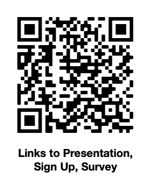

<!-- standardize height of slides - also make it bigger or side by side /-->

# How Usability and Reproducibility in Software Improves Teaching and Research

### Soren Harner, RC2AI

---

# Jim's 50 years in statistical computing

---

# 1970s and 1980s Interface of CS and Stat

* Early Interface Symposia
* Punchcards as flashcards
* Homework on line-printer paper
* Memory lane, Mountain View, CA

---

# 1990s Interactive Graphics in XLispStat

---

# 2000s IDEAL and JavaStat

* GUI with interactive graphics
* Data explortation and intuition
* Client-server architecture with Java and R
* On-line learning in HTML and Java Applets

<!-- 
Teach distributions, move parameters, see the change

/-->

---

# After 2015: RSpark and Reproducibility

* Teach data science courses and seminars
* Introduce SQL, DataFrames, MapReduce, Streaming
* Emphasis on reproducibility with Docker and Git
* Built on R, Spark, Apache Arrow, and Postgres
* Building on [rocker](https://www.rocker-project.org), R on Docker
* Brought back XLispStat with [xStatR](http://www.user2019.fr/static/pres/t246174.pdf)

---

# $Rc^2$ Reproducibility for Teaching

<!-- 
Reproducibility and Markdown for Teaching - continuation of IDEAL 
IDEAL was Applets and HTML; better in Markdown with R as a backend
/-->
  
---

<!-- _backgroundColor: black -->

---

# Reproducibility

Given the same raw data, can you follow the steps and understand the assumptions of how the authors arrived at their conclusion?

<!-- also repeat on different data /-->

---

# Why does it matter?

* Building on others' work
* Transparency over authority

---

# Reproducibility in research

* [Nature 2016 Survey](https://www.nature.com/articles/533452a) 52% say there is a crisis 
* [Nature 2021 Survey](https://www.nature.com/articles/s41562-021-01115-7) confidence in science leads to vaccination

---

# Reproducibility in teaching

* Data plays great role in all fields
* Rise of computational sciences
* Larger models and big data

<!-- also Sophia and R /-->

---

# Why is it hard?

* Methods and habits
* Accessible tools and data
* Everything is versioned
* Sharing and verifying identity

<!-- turn text in excel to red /-->

---

<!--
_backgroundColor: black
_color: white
-->

# Continuing Jim's Work

## Reproducibility helps teaching through sharing while it engenders skills and habits

<!-- Phboto of me and Jim /-->

---

# Author reproducibly

* VS Code Extension
* Versioned markdown
* Remotely executed code chunks
* Github, Bitbucket integration
* R, Python, Julia, etc.
* Javascript, CSS, vegalite
* Pull request to publish
* CLI and API

---

# Share, read, tinker

* Read, share, re-use interactive notebooks
* Mobile and Web
* Obviates the calculator
* Better than static books and reports
* Verifiable, tamperproof

<!-- Make text bigger or use animated gif showing editing /-->

---

# Hosted as a cloud service

<!-- Add second phone; make arrows bi-directional /-->

---

# Accessible, scalable cloud containers

<!-- Do a blow out of the contents; add 2 to end of OAuth2; Ballista /-->

---

# Use-case: instructor, student sharing

<!-- Make arrows one direction /-->

---

# Next steps

* Now: Collect feedback from the community
* Sept 2021: early user testing
* Early 2022: conduct pilots in representative courses
* Develop as Open Source
* Finalize free tier and commercial component

---

# Please get involved

* Join the pilot or give feedback ([feedback and sign up](https://forms.gle/9SCse7dwZFsenEEt7))
* Looking for open source collaborators
* Some funding available for developers

---

# Thank you for remember Jim

[Link to links on Jim's work, tributes, presentation, references, etc.](https://github.com/sharner/notecalc/blob/main/documents/sdss_preso/README.md)

[Feedback and sign-up](https://forms.gle/9SCse7dwZFsenEEt7)

<!-- Do a QR code and shortened URL /-->

<!-- Survey: I have access to use cloud /-->