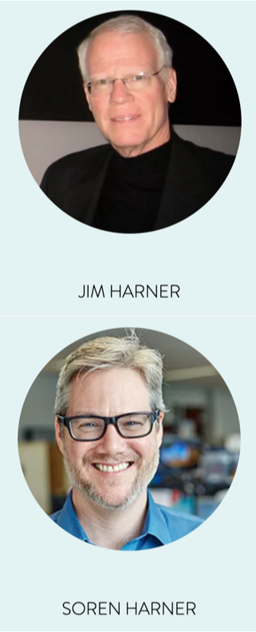

<!-- standardize height of slides - also make it bigger or side by side /-->

# How Usability and Reproducibility in Software Improves Teaching and Research

### Soren Harner, RC2AI

---

# Jim's 50 years in statistical computing

<!-- dont use angular text /-->

---

# 1990s Interactive Graphics in XLispStat

---

# 2000s IDEAL and JavaStat: GUI with R Backend

---

# After 2015: RSpark and Reproducibility

* Teach data science courses and seminars
* Introduce SQL, DataFrames, MapReduce, Streaming
* Emphasis on reproducibility with Docker and Git
* Built on R, Spark, Apache Arrow, and Postgres
* Building on [rocker](https://www.rocker-project.org), R on Docker
* Brought back XLispStat with [xStartR](http://www.user2019.fr/static/pres/t246174.pdf)

---

# $Rc^2$ Reproducibility for Everyone

  
---

<!-- _backgroundColor: black -->

---

# Reproducibility

Given the same raw data, can you follow the steps and understand the assumptions of how the authors arrived at their conclusion?

---

# Why does it matter?

* Building on others' work
* Transparency over authority

---

# Reproducibility in research

* [Nature 2016 Survey](https://www.nature.com/articles/533452a) 52% say there is a crisis 
* [Nature 2021 Survey](https://www.nature.com/articles/s41562-021-01115-7) confidence in science leads to vaccination

---

# Reproducibility in teaching

* Data plays great role in all fields
* Computational sciences
* Larger models and big data

<!-- also Sophia and R /-->

---

# Why is it hard?

* Methods and habits
* Accessible tools and data
* Version everything
* Sharing and verifying identity

<!-- turn text in excel to red /-->

---

<!--
_backgroundColor: black
_color: white
-->

# Making reproducible methods more teachable

## Continuing Jim's Work

<!-- Phboto of me and Jim /-->

---

# Author reproducibly

* VS Code Extension
* Versioned markdown
* Remotely executed code
* Github, Bitbucket integration
* R, Python, Julia, etc.
* Javascript, CSS, vegalite
* Pull request to publish

---

# Share, read, tinker

* Read, share, re-use interactive notebooks
* Mobile and Web
* Obviate the calculator
* Better than static books and reports
* Verifiable, tamperproof

<!-- Make text bigger or use animated gif showing editing /-->

---

# Accessible, scalable cloud containers

<!-- Do a blow out of the contents /-->

---

# Hosted as a cloud service

<!-- Add second phone /-->

---

# Use-case: instructor student sharing

<!-- Make arrows one direction /-->

---

# Next steps

* It was Jim's wish his work be continued as open source with a commercial component
* Collect feedback from the community
* Conduct pilots in representative courses
* Finalize commercial component

<!-- classes set up for Pilot in winter 2022 /-->

---

# Please get involved

* Join the pilot or give feedback ([feedback and sign up]())
* Looking for open source collaborators
* Some funding available for developers

---

# Thank you

[Link to presentation, references, etc.](https://github.com/sharner/notecalc/blob/main/documents/sdss_preso/)

[Feedback and sign-up](https://forms.gle/9SCse7dwZFsenEEt7)

<!-- Do a QR code and shortened URL /-->

<!-- Survey: I have access to use cloud /-->